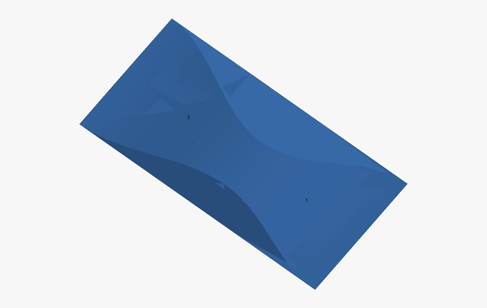
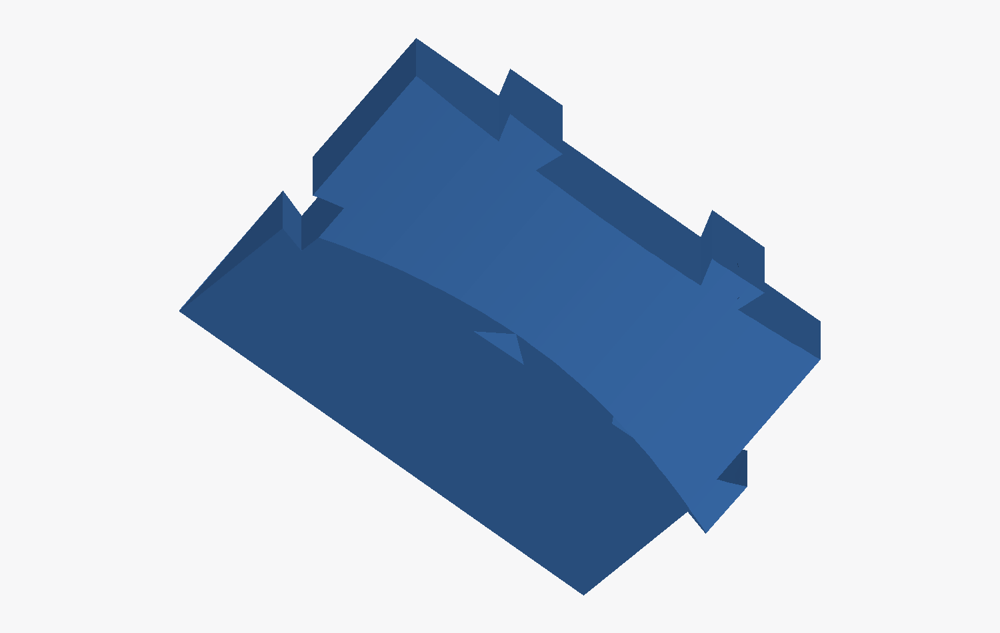

# Little Ripper — Ramp Generator

**→ [Open the generator](https://kunkles.github.io/bike-ramp/)**

Printable ramps for a toddler on a balance bike — a roller hill, a step drop, or
a little curved jump — split into tiles that fit your printer bed and lock
together with drop-in dovetails.



**Default hill:** 600 mm long × 300 mm wide × 45 mm tall, max slope **12.9°**.
6 tiles, largest 212 × 162 × 45 mm, plus 6 screw-in ground spikes. Roughly
**1.1 kg** of filament.

The profile has zero slope at both toes and at the crest, so there is no edge to
catch a wheel and no kick at the top — he rolls on, over, and off. The outer
90 mm of each side tapers to the floor, so riding off the side is a slope rather
than a drop.

## Files

| | |
|---|---|
| `webapp/coasting-hill.html` | **the generator** — sliders, live 3D, downloads the STLs as a zip |
| `webapp/style.css` | the look: late-80s freestyle BMX, Haro teal and hot magenta |
| `bikeramp.scad` | the same model in OpenSCAD; every dimension is a parameter at the top |
| `render.sh` | exports all tiles to `stl/` |
| `stl/tile_IJ.stl` | the default hill **without** spike sockets — also the test fixture. `I` = position along the run (0…2), `J` = across the width (0…1) |
| `docs/index.html` | the same app as a standalone page, served by GitHub Pages |
| `testplate/` | a one-plate test print with full-size joints — do this first |
| `stlinfo.py` | bounding box + filament estimate for exported STLs |
| `preview.py` | renders the STLs to a PNG |
| `webapp/geom.js` | the model reimplemented as a mesh generator, shared by the app and the tests |
| `webapp/test.js` | checks the mesher against OpenSCAD and proves every tile is watertight |
| `webapp/build.py` | inlines everything into the single-file app |

## The generator

Live at **[kunkles.github.io/bike-ramp](https://kunkles.github.io/bike-ramp/)**,
or open `docs/index.html` straight from disk — it is one self-contained file
with no dependencies, no server and no install. Pick your printer from the
dropdown, drag the sliders, and it
re-tiles live — showing tile count, largest tile against your bed, max slope,
filament and print time — then hands you a zip of STLs plus a README and a
matching `.scad`.

```bash
open webapp/coasting-hill.html
```

Rebuild it after editing anything under `webapp/`:

```bash
python3 webapp/build.py
```

## Or straight from OpenSCAD

STLs for the default hill are already in `stl/`. To re-render with changes:

```bash
./render.sh -D hill_height=70 -D hill_length=800
```

## Print the test plate first

[`testplate/`](testplate/) is a 180 × 160 × 30 mm hill that splits into two
tiles fitting a **single plate** — ~163 g, about 5 h. It is small but nothing on
it is scaled: the dovetail and thread clearances are the production values, so
it answers the two questions that actually matter before you commit a day of
printing. Does a tile drop onto its neighbour, and does a spike wind into its
socket? See [testplate/README.md](testplate/README.md).

## Printing

Six plates, one tile each. **Slice `tile_10.stl` first** — it's the tallest and
most expensive; its real time and weight tell you what the whole set costs.

| Setting | Value |
|---|---|
| Material | **PLA indoors. PETG or ASA if it ever lives in a garage, car, or sun** |
| Layer height | 0.28 mm (0.4 nozzle) |
| Wall loops | 3 |
| Top / bottom shells | 6 top, 4 bottom |
| Infill | 15% gyroid |
| Supports | none — every tile prints flat side down, no overhangs |
| Brim | yes, ~5 mm |

The PLA warning is the one that matters. PLA starts going soft around 55–60 °C
and a hill sitting in a sunny garage or the back of a car will sag out of shape.
Indoors it's fine.

Why those shells: a 15 kg kid plus bike landing on one wheel is roughly 250 N on
a contact patch around 150 mm², about 1.7 MPa. Gyroid at 15% carries that with
around 4× margin, and 6 top layers (1.7 mm) keeps the surface from dimpling
between infill cells. Dropping to 10% infill saves ~150 g and is still fine for
a toddler; go to 20% if he's on the bigger side or you want it to survive adults
standing on it.

Print time is extruded volume divided by an average throughput, plus 6 minutes
a plate for heat-up, levelling and purge. That throughput is the one number
carrying your printer, and the app sets it from whichever you pick — roughly
11 mm³/s for an X1C, 12 for an H2S, 8 for a MK4, 4 for a stock Ender 3. So the
default hill lands near 26 h on an X1C, 22 h on an H2S and 71 h on an Ender 3.

Those are class figures, not measurements. **Slice one plate, then nudge
*Average flow* until the app's time matches** — every later estimate follows
from it.

## Assembly



Tiles drop straight down into place; the dovetails are plan-view only, so any
tile can go in at any time and nothing needs sliding. Lay them out 3 along the
run × 2 across, matching the `tile_IJ` numbering, and press the seams together.
Sockets are cut with 0.35 mm clearance — snug, not a hammer fit. If a joint is
tight, a pass with a knife on the socket walls is quicker than reprinting; if
your printer runs tight in general, re-render with `-D fit=0.5`.

Label each tile as it comes off the plate. They all look similar and only one
arrangement is right.

**Stop it sliding.** The dovetails hold tiles to each other, but the assembly as
a whole will skate on a hard floor when he rides at it, and that's the thing
most likely to put him down. On carpet it's fine as-is. On hardwood, tile, or
concrete, do one of:

- stick adhesive rubber furniture pads under each tile, or
- run a bead of silicone caulk on the undersides and let it cure into feet, or
- put the whole thing on a rubber-backed rug.

Also check for a tile that rocks on an uneven floor before he rides it.

## Shapes

| | |
|---|---|
| **Roller** | Up and back down. Zero slope at both toes and at the crest, so there is nothing to catch a wheel. `humps: 2` gives a camel back. |
| **Step drop** | Rises, runs flat along a deck, then stops at a vertical edge. `hill_height` *is* the drop. |
| **Curved jump** | A circular arc tangent to the ground at the toe and steepest at the lip — so it launches — with a vertical face behind. |

The drop and the jump both finish at full height, so the far end of the last
tile is a vertical wall rather than a feathered toe. Two things follow from
that: leave clear flat run-out past the edge, and remember the back of the
thing is a wall if he rides at it the wrong way round. The side taper still
applies, so the edge is highest in the middle and falls away at the sides.

The app reports the number that matters for each: **max slope** for a roller,
the **approach** gradient for a drop, and the **takeoff** angle for a jump.

Starting points, all gentle: drop 500 × 300 × 50 with a 150 mm deck (12.4°
approach), jump 350 × 300 × 40 (12.7° takeoff, ~0.6 kg and 16 h — much cheaper
than the roller).

## Decals

Raised graphics on the side flanks — a blocky stencil word and a checkered band.
Type whatever you like in **Says**; A–Z, 0–9 and a few marks are supported and
anything else is dropped.

Each word gets its own line, so "LITTLE RIPPER" stacks as two. That is not just
styling: one long line has to cross the tile joints, where it gets trimmed away
and letters come out chopped. Stacked words make a block small enough to sit
inside a single tile, and the generator places it on the tallest joint-free run
of the ramp — high enough that the riding surface does not clamp it flat.

**Nothing goes on the riding surface.** Relief under a 12" wheel is a bump and a
trip edge, so decals live only on the flanks, which are already sloped and not
ridden on. That is not a convention, it is enforced by the geometry: the height
field is `min(profX, profY + relief)`, and the `min` clamps a decal to the
riding surface rather than letting it rise above.

Decals also stop short of every joint, by the seam plus a dovetail either side.
Relief on a tab or inside a socket would foul the fit, and the tiles are
separate prints with clearance anyway — a letter spanning a joint reads as
broken however it is meshed.

The letters are a 5×7 stencil so every edge is axis-aligned and lands on a mesh
grid line exactly, which is what keeps them crisp and lets OpenSCAD and the mesh
generator agree block for block.

## Ground spikes

On by default at ¼ inch; the **Underside** view in the app shows the sockets.
Each tile thick enough to take one gets a single
blind socket in its underside — a 14.6 mm twelve-sided bore, 11 mm deep, with at
least 5 mm of deck left above it — and you print one screw-in spike per socket.
The toes are only a millimetre or two thick so they get none; the dovetails tie
them to the tiles that are pegged down.

**The socket is threaded to match the spike** — the same 3 mm-pitch form pushed
out by 0.25 mm of radial clearance, so the two mate at every point rather than
the spike cutting its own groove. There is 8 mm of engagement, a plain lead-in
at the mouth to start the screw and a relief at the far end so the ceiling
closes flat. Wind one in by the hex flange until it meets the tile; they unscrew
again for indoor use.

Print the spikes stud-down exactly as oriented, no supports, 4 walls and 40%
infill; they're 1–2 g each. With spikes fitted the hill stands about 3 mm off
the ground.

Making that thread work meant lofting the socket wall rather than extruding it:
a helix is not a height field, but the bore radius can follow one if each rim
point is pushed along its own radius, and that offset is zero at both plain ends
so the rim and ceiling still land exactly on the plan polygon. The tile stays a
single closed body.

Spike length is ¼, ½ or 1 inch (6 / 13 / 25 mm). ¼ inch is plenty for lawn.
Set it to **None** for a flat underside with no sockets at all — but the socket
is a small blind hole in a part you are printing anyway, so leaving it in keeps
the option open.

## Changing the shape

| Parameter | Default | Notes |
|---|---|---|
| `shape` | `"roller"` | `"roller"`, `"drop"` or `"kicker"` |
| `deck` | 150 | drop only: flat run before the edge |
| `hill_length` | 600 | longer = gentler |
| `hill_width` | 300 | |
| `hill_height` | 45 | |
| `humps` | 1 | roller only. 2 gives a camel back — lengthen to match or it gets steep |
| `bevel_run` | 90 | side taper. 0 = vertical sides (don't, for a toddler) |
| `edge_lip` | 1.2 | thickness at the toe. Keeps it printable instead of a 0 mm feather |
| `bed_x` / `bed_y` | 250 / 250 | usable bed. Tiling is computed from these |
| `fit` | 0.35 | dovetail socket clearance per side |
| `spike_len` | 0 | ground spike protrusion. 6 / 13 / 25 for ¼ / ½ / 1 inch |
| `grip_depth` | 0 | try 0.6 for shallow traction grooves across the surface |

Beds are often oblong — a MK4 is 250 × 210 — so the tile grid is laid out both
ways round and whichever needs fewer plates wins. A tile that only fits turned
is flagged in the app.

The app's printer list covers Bambu (X1C/X1E/P1S/P1P, A1, A1 mini, H2S, H2D and
H2D Pro), Prusa (MK4S/MK4/MK3S+, MINI+, XL), Creality (Ender 3, K1, K1 Max) and
a Voron 350, and takes 6 mm off each axis for edge margin. Anything else, type
the numbers in.

For the **H2D and H2D Pro** the figures used are the *single-nozzle* printable
area, 325 × 320. The headline 350 mm plate width only applies with both nozzles
loaded with the same filament, which is not how you would run these tiles. The
**H2S** is single-nozzle by design, so its 340 × 320 stands. Either one prints
the default hill in **two tiles instead of six**.

`render.sh` echoes the shape and its steepest gradient for whatever you set.
Some starting points:

```bash
./render.sh -D hill_height=70 -D hill_length=800     # 15.1°, 8 tiles, taller
./render.sh -D humps=2 -D hill_length=1000 -D hill_height=50   # 17.0°, camel back, 10 tiles
./render.sh -D 'shape="drop"' -D hill_length=500 -D hill_height=50 -D deck=150
./render.sh -D 'shape="kicker"' -D hill_length=350 -D hill_height=40
./render.sh -D bed_x=244 -D bed_y=204                # Prusa MK4
./render.sh -D spike_len=6                           # add the spike sockets
openscad -o spike.stl -D 'part="spike"' -D spike_len=6 bikeramp.scad
```

Keep it gentle. A hill he can't get up isn't fun, and 13° is already a steep
driveway. Print the default, watch him ride it, then decide whether to go bigger.

## Mesh accuracy

The riding surface is `min(profX, profY)`, so it **folds** along the curve where
the two are equal — the join between the riding face and the side taper. A flat
facet cannot span a fold, and because the fold runs diagonally to the mesh grid
it came out visibly serrated: over a millimetre out on the default hill, nearly
two on a short steep one. Refining the grid barely helped, because a crease is
not curvature.

Cells straddling the fold are now split along it, the same way they are already
split along dovetail edges, so each half sits on one smooth branch. The cut
point on a shared edge is interpolated from that edge alone, so the neighbouring
cell computes the same point and the surface stays closed. Worst-case error went
from 1.32 mm to 0.017 mm on the default hill, for about the same triangle count
— and agreement with OpenSCAD, which does exact CSG and never had the problem,
tightened from ~0.05% to ~0.01%.

Cell size also follows the profile now: a flat facet sags by roughly
`h″·cell²/8`, so the mesh picks its own spacing from the sharpest curvature to
hold 0.05 mm. Long gentle hills stay coarse and fast; short steep ones refine
themselves.

## What's been checked

Geometry only — nothing here has been printed or ridden.

- Every tile fits the X1C bed (largest 212 × 162 × 45 mm).
- The six tiles sum to 4.81 cm³ *less* than the uncut hill, which matches the
  calculated dovetail clearance volume (4.79 cm³) to within 0.5% — so the tabs
  and sockets are complementary, correctly placed, and nowhere overlapping.
- The riding surface is continuous across every seam, and follows the height
  field to within 0.05 mm across eight shapes including the fold at the side
  taper (`node webapp/test.js`, section 5).
- Every tile is **manifold**, not merely closed: each undirected edge is shared
  by exactly two faces, across 17 configurations. Edge-cancellation alone — what
  the suite checked before — passes meshes where four faces meet on one edge,
  which is what zero-area triangles and corner-touching decal blocks produce.
  Adding that check found and fixed 60 such edges around the spike sockets that
  had been passing as watertight.
- No decal rises above the riding surface, and none overlaps a dovetail.
- The generator's mesher agrees with OpenSCAD to within 0.15% on every tile
  (0.06% with spike sockets, 0.05% on the drop and the jump, 0.21% on the spike
  itself), and its exported STLs stay manifold after rounding to float32
  (`node webapp/test.js`).
- All three shapes stay watertight, including the vertical end face, across
  extremes of height, deck length and zero side taper.
- Spike sockets keep every tile watertight, and the volume they remove
  converges on the analytic threaded bore as the mesh is refined (1.6% at the
  default 8 mm cell, 0.2% at 1.5 mm — the residue is surface discretisation,
  not the socket).
- Spike and socket are sampled against each other over the whole engaged band:
  the radial gap is 0.250 mm everywhere, to within floating point. A sign or
  amplitude slip in either thread would still print and still be watertight, and
  simply not screw together — so this is checked directly rather than inferred.

The shell/infill and print-time numbers above are analytical, not measured.
Per-printer throughput figures are rough classes; the app exposes the number so
you can correct it from a real slice.
